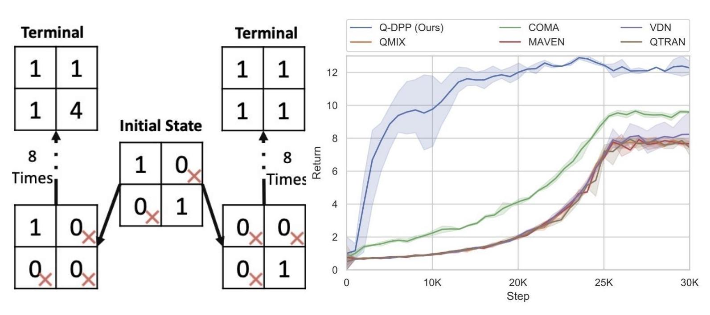
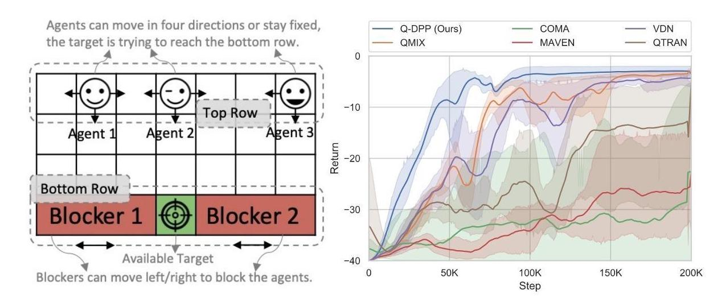
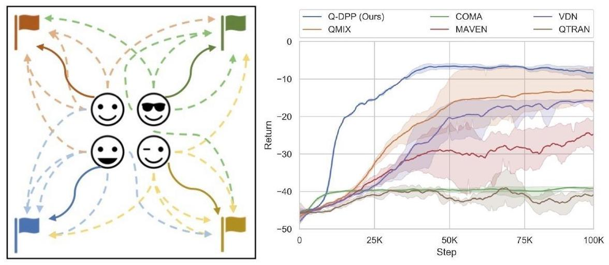
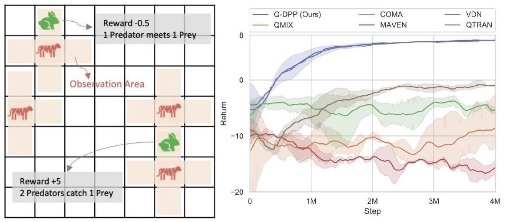
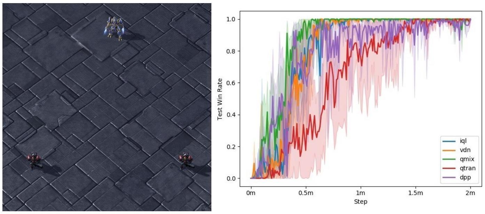

### What is Q-DPP
> Q-DPP is a a novel extension of determinantal point process (DPP) to multi-agent reinforcement learning problems. Q-DPP promotes agents to acquire diverse behavioral models; this allows a natural factorization for the joint Q-functions with no needs for a priori structural constraints, which are often required by centralized-training-decentralized-exeuction methods. A bonus of Q-DPP is that it offers an unified view of current major solvers including VDN, QMIX, and QTRAN.


### How to run Q-DPP

- Setup the environment:

```bash
conda create -n dpp python=3.5
conda activate dpp
pip install -r requirements.txt
conda install matplotlib
conda develop add ./ma-gym
```

- Set up StarCraft II and SMAC:

```
cd pymarl
bash install_sc2.sh
```

- Run quick examples:

```python
cd ../pymarl
python src/main.py --config=qdpp --env-config=grid
python src/main.py --config=qmix --env-config=grid  with env_args.game_name=Spread-v0 
```

- Run all experiments in parallel:
```bash
cd pymarl/scripts
bash head_run.sh
```


### The Performance of Q-DPP

> We evaluate Q-DPP on five different games against popular baseline models, and present the executable commands for reproducibility and corresponding experimental performance.

|              Game               |   State    |
| :-----------------------------: | :--------: |
|     Multi-Step Matrix Game      |  Discrete  |
|          Blocker Game           |  Discrete  |
|     Coordinated Navigation      |  Discrete  |
| Predator-Prey (2 vs 1 & 4 vs 1) |  Discrete  |
|     StarCraft II (2m_vs_1z)     | Continuous |


- Stochastic Normal-form Game

```bash
python src/main.py --config=qdpp_nmatrix --env-config=nmatrix_idx with embedding_init=normal
```



- Blocker Game, Coordinated Navigation, and Predator-Prey

```bash
bash run_exp3.sh
```

> Blocker Game:



> Coordinated Navigation:



> Predator-Prey:



- StarCraft II (details of Deep Q-DPP can be found in [results_on_qdpp.pdf](results_on_qdpp.pdf).)

```bash
bash run_2m_vs_1z.sh
```




### Q&A:

- How can I find codes related to Q-DPP model? / Why do I only find `ma-gym` and `pymarl` packages? 

> Q-DPP is based on [pymarl](https://github.com/oxwhirl/pymarl). We implement codes related to Q-DPP in `./pymarl/src/` with *qdpp* in their file names, including `./pymarl/src/controllers/qdpp_controller.py`, `./pymarl/src/learners/qdppq_learner.py` and  `./pymarl/src/modules/mixers/qdpp.py`.


- Why do my local codes fail to run?

> Please check your environment, especially `ma-gym` package. Since we modified some parts of the package, please make sure that you installed `ma-gym` with the one that we provided. If you are testing on StarCraft environment, you can execute the following command in your terminal to check if SC2 is installed:
```bash
echo $SC2PATH
```
> A valid directory is expected. Empirically, the provided codes should work well with PyTorch v1.4.0. Due to NVIDIA driver issues, it is still possible to see incompatible datatype errors raised. We recommend to check if data are copied to correct devices via commands like `.cuda()` or `.cpu()`. 
